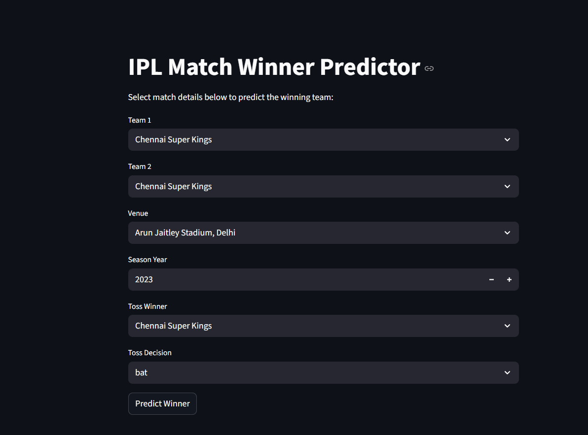

#  IPL Match Winner Predictor (Machine Learning + Streamlit)

An interactive **IPL match winner prediction application** built using Python, Pandas, NumPy, scikit-learn, and Streamlit. The model predicts the winning team between two IPL sides based on historical data, toss decisions, venue factors, and team strength.

---

##  Features

### 🔹 Machine Learning
* **Data Set:** Trained on **1090 IPL matches**.
* **Preprocessing:** One-hot encoded teams, venues, and toss data.
* **Algorithms:** Tested Logistic Regression, Random Forest, and Gradient Boosting.
* **Model:** The best-performing model is saved and loaded via `joblib`.

### 🔹 Streamlit Web App
* **User Interface:** Clean, interactive UI for selecting match details.
* **Smart Logic:** Toss winner dropdown is automatically restricted to the two selected teams.
* **Output:** Displays the predicted winner along with a **winning probability distribution** (bar chart).

### 🔹 Intelligent Team Mapping
Handles legacy franchise names to ensure accurate predictions:
* *Delhi Daredevils* → **Delhi Capitals**
* *Kings XI Punjab* → **Punjab Kings**
* *Royal Challengers Bangalore* → **Royal Challengers Bengaluru**
* *Rising Pune Supergiant* variants merged.
* Removes duplicate display names for cleaner data.

---

##  Tech Stack

| Category | Technologies / Libraries |
| :--- | :--- |
| **Languages** | Python |
| **Data Manipulation** | Pandas, NumPy |
| **Machine Learning** | scikit-learn, Joblib |
| **Visualization** | Matplotlib, Seaborn |
| **Web Framework** | Streamlit |

**Key Concepts Applied:**
* Data Cleaning & Feature Engineering
* One-Hot Encoding
* Train–Test Split & Model Evaluation
* Probability Prediction (`predict_proba`)

---

##  Project Structure

```text
IPL-analysis-ml-project/
│
├── app/
│   └── app.py                # Main Streamlit application
│
├── models/
│   ├── win_predictor.pkl     # Trained ML model
│   └── feature_columns.json  # JSON file for feature consistency
│
├── notebooks/
│   ├── 01_eda.ipynb                # Exploratory Data Analysis
│   ├── 02_feature_engineering.ipynb # Feature Engineering steps
│   └── 03_model_training.ipynb      # Model training and comparison
│
├── data/
│   ├── matches.csv           # Match-level data
│   └── deliveries.csv        # Ball-by-ball data
│
└── README.md
```

---

##  Installation & Running Locally

Follow these steps to set up the project on your local machine.

### 1️ Clone the repository
```bash
git clone https://github.com/NishantTripathi21/IPL-analysis-ml-project
cd IPL-analysis-ml-project
```

### 2️⃣ Create a virtual environment
```bash
python -m venv venv
```

### 3️⃣ Activate the environment

* **Windows (PowerShell):**
    ```powershell
    .\venv\Scripts\Activate.ps1
    ```
* **Windows (CMD):**
    ```cmd
    venv\Scripts\activate
    ```
* **Mac/Linux:**
    ```bash
    source venv/bin/activate
    ```

### 4️⃣ Install dependencies
```bash
pip install -r requirements.txt
```

### 5️⃣ Run the Streamlit app
```bash
python -m streamlit run app/app.py
```

---

## 🖼 Screenshots

### 🏠 App Homepage
**


### 🎯 Prediction Output
**

---

## 💼 Skills Demonstrated
* Machine Learning Workflow
* Feature Engineering & Data Analysis
* Model Evaluation & Selection
* Streamlit Web Development
* Python Project Structuring
* Git & GitHub Workflow

---

## 👨‍💻 Author

**Nishant Tripathi**
* **B.Tech CSE, NIT Srinagar**
* *Interests:* ML • Backend • Web Development • Cloud 

[GitHub](https://github.com/NishantTripathi21) | [LinkedIn](https://linkedin.com/in/nishanttripathi21)